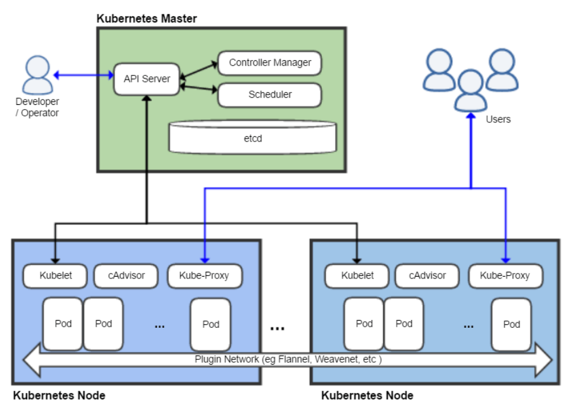

# Docker/Kubernetes
[Docker](https://www.docker.com/)  
[Kubernetes](https://kubernetes.io/de/) 

## Docker
> Docker legt Programme samt ihren Abhängigkeiten in Images ab. Diese bilden die Basis für virtualisierte Container, die auf nahezu jedem Betriebssystem lauffähig sind. So werden Anwendungen portabel und unkompliziert, sei es während der Entwicklung oder beim Skalieren von SaaS-Clustern.

## Docker Container
Wird ein Container gestartet, so wird nicht eine isolierte VM gestartet, sondern ein isolierter Prozess (z.b. /bin/sh), wenn der Prozess beendet wird, so wird der Container beendet.  
Unterschied Container - Emulation: 
* Emulation emuliert Filesystem + Kernel + OS + Applikationen
* Container verwendet bestehendes Filesystem + Kernel (e.g., Linux-Filesystem in Unterordner des Host-Systems) / Alle Container teilen sich denselben Kernel, also darf der Benutzer in einem Container den Kernel nicht ändern (e.g., ändert er die Systemzeit, so ändert er die Systemzeit für alle laufenden Container)

Docker holt sich das image (z.b. nginx:alpine), macht eine Kopie eines Snapshots (nicht das ganze Filesystem) in einem Unterordner, startet den Container und lässt den laufenden Container nicht aus diesem Unterordner raus.

* Docker virtualisiert Applikationen in ihrem eigenen Filesystem.
* Sind welche Images da `docker image ls`   
* Sind welche aktive Container da `docker container ls`  
* Welchen Ressourcen verbrauch hat ein *Applications*-Container `docker container stats`
* Was hat sich an einem Container zum Image geändert `docker container diff CONTAINER ID`
* Wir starten einen interaktiven Container alpine-Image `docker container run --rm -ti alpine`  
  * Alle Daten werden beim beenden gelöscht `--rm`
  * Interaktive Shell steht zur Verfügung `-ti`
  * Container läuft mit `-d` im Hintergrund
* In Docker ist es möglich in einen Container zu springen
    ```
    docker container run --detach --rm  --name www nginx:alpine
    docker container exec -ti www sh
    ```
* In Docker ist es möglich einzelne Befehle in einen Container abzusetzen `docker container exec -ti CONTAINER_NAME BEFEHL`
* Container sollen nicht aufs Filesystem, sondern auf `StdOut` und `StdErr` schreiben.

**Vorteile**  
* Paketemanager für Images/Registry
* Es gibt kein Overhead für Applikationen (siehe Container Ressourcenverbrauch)
* Keine Artefakte auf dem Host-System

**Container-Eigenschaften**  
* Container ist ein Laufender Prozess eines Images
* Der Container gibt es nur solange der Prozess läuft
* Es können mehrere gleiche Container gleichzeitig gestartet werden (haben keinen Einfluss aufeinander)
* Ein Container greift nur lesend auf sein Image zu  
* Jeder Container speichert seine Änderungen separat  
* Ein neuer Container startet immer im Originalzustand
    * Beweis:
        ```
        docker container run -ti ubuntu bash
        # rm -rf /bin
        # ls
        # exit
        docker container run -ti ubuntu bash
        # ls
        ```

> Beim Stoppen eines Containers bleiben die States bestehen im Filesystem. Gestoppte Container können aufgelistet werden mit `docker container ls -a`. Um Container zu terminieren `docker container prune` *(damit das Filesystem wird den Grundzustand annimmt)*. Einzelne Container können mit `docker container rm CONTAINER` terminiert werden. 

### Volume
* Container persistieren nicht
* Meist wird hierzu ein Volume verwendet
* Ist in Kubernetes nicht anders
* K8s verwendet nicht das Volume-Pluginsystem von Docker!
* K8s verwendet sein CSI (ContainerStorageInterface)
* Named Volumes können dynamisch erstellt werden
* Abstraktion vom Host
* Pluginfähig

Hier erstellt Docker automatisch ein (wiederverwendbares) Volume mit dem Namen: *data*. 
```
docker container run --rm -ti --volume  data:/srv alpine
```

Alle vorhandenen Volumen anzeigen: `docker volume ls`  
Schreibe in das Container-FS /srv und beende den Container wieder. Danach starte den Container erneut. (Schaue im Container und /srv nach den Änderungen)  

In einem anderen Fenster:
```
docker volume ls
docker volume inspect data
```
```
[
    {
        "CreatedAt": "2020-02-18T12:57:01Z",
        "Driver": "local",
        "Labels": null,
        "Mountpoint": "/var/lib/docker/volumes/data/_data",
        "Name": "data",
        "Options": null,
        "Scope": "local"
    }
]
```
Führen Sie die beiden letzten Anweisungen nach dem Beenden des Containers aus.
> Klassiker `docker  container run --rm -ti --volume /var/log:/srv alpine`

### Netzwerk
Docker sind die Container pro Host hinter einem (NAT) Netzwerk
```
docker run -p 8080:80 --name www nginx:alpine
curl localhost:8080
```
* Portmapping bedeutet immer von außen auf die Container zugreifen können.
* Also ohne Portmapping kein Zugriff auf die Container
* Analog zu K8s (hier NodePort, HostPort)
  * In Kubernetes spannt sich ein (einziges) gemeinsames Netzwerk für alle Pods/Container auf

### Bidirektionale Kommunikation
```
docker network create netz
docker network ls
docker run --rm -d  --name foo --net netz alpine sleep 5000
docker run --rm --name bar --net netz alpine ping foo
docker container stop foo
docker network rm netz
```
* Kubernetes verwendet nicht das Netzwerkmanagement von Docker (sondern das CNI).
* Gemeinsames überspannendes Netzwerk in K8s default.

### Container Netzwerk
`docker container run --rm --net host -ti alpine`
|NETWORK ID|NAME|DRIVER|SCOPE|
| - | - | - | - | 
|e8e22cfdac82|bridge|bridge|local|
|30585fc6f617|host|host|local|
|35e9e964c57a|none|null|local|
|...|...|...|...|

**Fenster 1:**  
`docker container run --name uno -ti alpine`  
**Fenster 2:**  
`docker container run --name due --net container:uno -ti alpine`  

Beim Untersuchen der IP-Adressen stellt man fest, dass sich beide Container im gleichen Netzwerk befinden.

***
#### Kleines Beispiel: Ressourcenverbrauch
* Geschwindigkeit
* Dichte
* Platzverbrauch:
```
time for i in $(seq 1 100);  \
do docker container run -d --rm  --name nginx$i --publish-all  nginx:alpine; done
```
Platzverbrauch anzeigen `docker container ps -s`  
* Das Image wird nur einmal angelegt.
* Alle weiteren Container speichern nur die Differenz zu dem Image.
  * Deshalb belegt ein Container wenig Ressourcen  

Container wieder löschen `docker container ps -aq | xargs docker container rm -f`

Ein einzelner Container genauer untersuchen. 
```
docker container run --name www --rm --detach nginx:alpine
docker container stats
docker container ps -s
docker container diff www
docker container stop www (docker container kill www)
```

#### Kleines Beispiel: Logdateien
```
docker container run --rm --name aha -d busybox sh -c 'while true; do date; sleep 1 ; done'
docker container logs aha
```
Die Logdateine sind auch unter `var/lib/docker/container/CONTAINER_ID/CONTAINER_ID-json.log` vorhanden, solange der Container läuft.
```
docker container stop aha
```
***

### Sicherheit Docker

#### Container/Volumes read-only verwenden
* Container read-only starten
* Volumes read-only mounten
```
docker container run --rm -ti --read-only  alpine
docker container run --rm -ti --volume /var/tmp/:/srv/:ro alpine
```
> Schöner Default, wenn die Container stateless sind.

#### Container als User laufen
* Docker starten im Default Container als root
* Der Prozess ist ein root Prozess im Kernel
* Unnötiger Attack-Vector
* Container als User laufen lassen
  * Beim Image-Bau kann eine DefaultID angegeben werden
  * Folgende Option überschreibt auch diese  
  `docker container run --rm --user 1000:1000 alpine id` [UID:GID]
* UID und GID ausgeben `cat /etc/passwd`

#### Memory/CPU Limits
Applikationscontainer sollten immer limitiert sein. *(In Kubernetes kann dies sogar enforced werden.)* Zum limitieren der Ressourcen werden die Cgroups *(Controlgroups = Standard in jedem Kernel)* des Linux Kernels verwendet.  
Voraussetzung: Wir verwenden das Image jess/stress um die Verwendung in Cgroups in Linux zu zeigen.  

Der Container cg2 wird beendet, da dieser zu viel Speicher (200m) durch das Image jess/stress belegt.
```
docker container run --rm -ti jess/stres
docker container run --rm -m 128m --name cg1 jess/stress --vm 1 --vm-bytes 100m --vm-hang 0 
docker container run --rm -m 128m --name cg2 jess/stress --vm 1 --vm-bytes 200m --vm-hang 0
```
```
stress: info: [1] dispatching hogs: 0 cpu, 0 io, 1 vm, 0 hdd
stress: FAIL: [1] (415) <-- worker 6 got signal 9
stress: WARN: [1] (417) now reaping child worker processes
stress: FAIL: [1] (421) kill error: No such process
stress: FAIL: [1] (451) failed run completed in 0s
```
Partitionierung von CPU Zeit (CFS im Kernel required) in CPUs.
```
docker container run --rm --name cpu  --cpus="1.5" jess/stress -c 2 
```
CPU-Gewichtung
```
docker run -d --name uno --cpu-shares=100  --cpuset-cpus=1 jess/stress -c 1 
docker run -d --name due --cpu-shares=400  --cpuset-cpus=1 jess/stress -c 1 
```
In einem weiteren Fester kann die Auslastung der Container mit `docker stats` ausgegeben werden.

#### Kleines Beispiel: Forkbombe
```
docker  run --pids-limit 100 --rm -ti ubuntu
```
In dem Container kann eine Endloss-Loop `:(){ :|:&};:` aufgerufen werden und die Limitierung wird nicht überschritten. Ohne die Limitierung benötigt der Container immer mehr CPU-Leistung.

#### Eigene Profile "seccomp"
* Secure Computing Mode
* Filter für Syscalls
* Programme, die auf das System zugreifen wollen nutzen Syscalls
* Diese können gefiltert werden

Diese Datei im Filesystem hinterlegen `/var/tmp/policy.json`:
```
{
  "defaultAction": "SCMP_ACT_ALLOW",
  "syscalls":[
    {
      "name": "mkdir",
      "action": "SCMP_ACT_ERRNO"
    },
    {
      "name": "chown",
      "action": "SCMP_ACT_ERRNO"
    }
  ]
}
```
```
docker run --rm -it --security-opt seccomp=/var/tmp/policy.json alpine 
```

## Docker Image
* Read-Only Vorlagen für Container
* Linuxfilesystem
* Metainformationen
* Eine Composition von Layern

### Dockerfile
* Dockerimages werden durch einfache "Makefiles(Dockerfile)" erstellt.
* **"Jede" Anweisung im Dockerfile erstellt einen Layer**
* Die Summe der Layer ist das Image  

#### Dockerfile CMD
Die Steuerdatei heisst Dockerfile. Erstelle und editire in einem eigenen Verzeichnis *Date* ein *Dockerfile* mit folgendem Inhalt. *(MAINTAINER ist veraltet, jedoch alle verwenden es noch...)*
```
mkdir /var/tmp/Date
cd /var/tmp/Date
touch Dockerfile
```
```
FROM ubuntu:18.04
MAINTAINER mail@to.me
CMD ["date"]
```
Das Image bauen.
```
docker image build --tag dateimage:v1 .
docker image ls dateimage:v1
```
Das Verhalten beim Aufruf mit Option testen:
```
docker container run --rm dateimage:v1 
docker container run --rm dateimage:v1 pwd
````
Beim Beachten der Historie das neue Image, ist nun ersichtlich welche neue Layers zum Image hinzugefügt wurden.  
```
docker history dateimage:v1
```
```
IMAGE           CREATED          CREATED BY                                      SIZE        COMMENT
f93026bb9918    20 minutes ago   /bin/sh -c #(nop)  CMD ["date"]                 0B       
65c88bbbb0c4    20 minutes ago   /bin/sh -c #(nop)  MAINTAINER mail@to.me        0B       
ccc6e87d482b    4 weeks ago      /bin/sh -c #(nop)  CMD ["/bin/bash"]            0B       
<missing>       4 weeks ago      /bin/sh -c mkdir -p /run/systemd && echo 'do…   7B          
<missing>       4 weeks ago      /bin/sh -c set -xe   && echo '#!/bin/sh' > /…   745B    
<missing>       4 weeks ago      /bin/sh -c [ -z "$(apt-get indextargets)" ]     987kB   
<missing>       4 weeks ago      /bin/sh -c #(nop) ADD file:08e718ed0796013f5…   63.2MB  
```
Im vergleich zu dem bestehenden Image *ubuntu:18.04*
```
docker history ubuntu:18.04
```
```
IMAGE           CREATED         CREATED BY                                      SIZE       COMMENT    
ccc6e87d482b    4 weeks ago     /bin/sh -c #(nop)  CMD ["/bin/bash"]            0B                   
<missing>       4 weeks ago     /bin/sh -c mkdir -p /run/systemd && echo 'do…   7B                  
<missing>       4 weeks ago     /bin/sh -c set -xe   && echo '#!/bin/sh' > /…   745B                
<missing>       4 weeks ago     /bin/sh -c [ -z "$(apt-get indextargets)" ]     987kB               
<missing>       4 weeks ago     /bin/sh -c #(nop) ADD file:08e718ed0796013f5…   63.2MB     
```
> Docker Image inspizieren mit `docker image inspect dateimage:v1`

#### Dockerfile ENTRYPOINTS
```
FROM ubuntu:18.04
MAINTAINER mail@to.me

ENTRYPOINT ["ls"]
```
```
docker build -t lsimage:v1 .
docker container run --rm lsimage:v1 
docker container run --rm lsimage:v1 -l
```
Somit wäre es nicht mehr möglich `docker container run --rm lsimage:v1 pwd`, da es den Befehl `ls pwd` nicht existiert.
Ein Entrypoint kann via Commandline überschrieben werden `docker container run --entrypoint bash <image>`

Es gibt die Möglichkeit Standartwerte zu setzen.
```
FROM ubuntu:18.04
MAINTAINER mail@to.me

CMD ["-l"]
ENTRYPOINT ["ls"]
```
Auch mehrere Optionen:
```
CMD ["-l","-a"]
ENTRYPOINT ["ls"]
```

#### Dockerfile RUN
* RUN ändert das Filesystemlayout
* Eigener LAYER (docker container diff)
* Achtung RUN wird im (FROM) Container ausgeführt
* RUN führt ein Kommando im Container-Bau aus  

RUN-Befehl wird nur **einmal** ausgeführt und ändert das Filesystemlayout. Alle weiteren Container verwenden nun das Veränderte Filesystem, welches durch den RUN-Befehl geändert wurde.

```
FROM alpine
RUN  apt-get install python3
```
```
FROM alpine
RUN  ["apt-get", "install", "python3"]
```
> Je nach Baseimage macht es ein unterschied, wenn der Befehl in Exec-Form ausgeführt wird, ruft er die ausführbare Datei direkt auf und die Shell-Verarbeitung findet nicht statt.

#### Dockerfile ENV und EXPOSE
* ENV setzt Variable
* EXPOSE definiert einen Port für -P
  * *Sollte lieber über den `-p` Befehl erfolgen.*

Umgebungsvariables und Portmapping können auch zur Laufzeit gesetzt werden.  
```
docker container run --rm -e ICH_BIN=EINE_UMGEBUNGSVARIABLE ...
docker container run --rm -p 8080:80 ...
```

***
#### Kleines Beispiel: NGINX
```
FROM ubuntu:18.04
ENV DEBIAN_FRONTEND noninteractive
RUN apt-get update
RUN apt-get install -y nginx-light
RUN echo "daemon off;" >>/etc/nginx/nginx.conf
RUN echo "Hello, NGINX!" > /var/www/html/index.html
EXPOSE 80
ENTRYPOINT ["/usr/sbin/nginx"]
```
Nginx-Image bauen und starten:
```
docker build -t image/nginx .
docker container run -d -P image/nginx
```
Der exposte Prot kann mittels `docker container ls` herausgefunden werden.
```
curl localhost:<Port>
```
```
Hello, NGINX!
```
***

#### Dockerfile COPY
* Oft sollen Daten/Verzeichnisse in das Image gelangen.
* Das geschieht mit COPY.
* Achtung es handelt sich um einen relativen Pfad.

***
#### Kleines Beispiel: HTML-Dateien kopieren
Hierfür wird ein Verzeichnis `html` mit mindestens einer index.html gebraucht.
```
FROM ubuntu:18.04
ENV DEBIAN_FRONTEND noninteractive
RUN apt-get update
RUN apt-get install -y nginx-light
RUN echo "daemon off;" >>/etc/nginx/nginx.conf
COPY html /var/www/html/

EXPOSE 80
ENTRYPOINT ["/usr/sbin/nginx"]
```
***

#### Dockerfile VOLUMES  
* Volumes sind nicht im Layer `docker volume ls`  
```
VOLUME  /var/tmp/data
```
*Sollte lieber über den `--volume` Befehl erfolgen.*

#### Dockerfile Sicherheit
```
FROM ubuntu:18.04
RUN useradd  -u 1000 foo
USER  foo:foo
ENTRYPOINT ["id"]
```
```
docker build -t foo . 
docker container run --rm  foo
```
Achtung bei VOLUMES gelten UID/GID

#### Dockerfile Sicherheit
* LABEL setzt Metainformationen
  * MAINTAINER ist veraltet
```
LABEL architecture="amd64" 
LABEL maintainer="mail@to.me"
```
Zugriff auf die Label via:
```
docker inspect -f '{{.Config.Labels}}' 
docker images --filter "label=architecture"
docker images --filter "label=architecture=amd64"
docker container ps --filter "label=architecture=amd64"
```

#### Multistage
Benötigt ca. 400MB:
```
FROM golang:alpine
WORKDIR /app
COPY ./hello.go /app
RUN go build -o goapp
ENTRYPOINT ["/app/goapp"]
```
Benötigt ca. 8MB:
> Multi-Stage Build: Teil-Build ist nur zur "Unterstützung" da, z.B. zum Kompilieren. Von diesem Build wird nur der Output verwendet für den folgenden Build. So kann der schlussendliche Output viel kleiner sein.  
```
FROM golang:alpine AS builder
WORKDIR /app
COPY ./hello.go /app
RUN go build -o goapp
ENTRYPOINT ["/app/goapp"]

FROM alpine:latest
COPY --from=builder /app/goapp /app/goapp
ENTRYPOINT ["/app/goapp"]
```

## Kubernetes
> Kubernetes bietet eine containerzentrierte Managementumgebung. Es koordiniert die Computer-, Netzwerk- und Speicherinfrastruktur im Namen der Benutzer-Workloads. Dies bietet einen Grossteil der Einfachheit von Platform as a Service (PaaS) mit der Flexibilität von Infrastructure as a Service (IaaS) und ermöglicht die Portabilität zwischen Infrastrukturanbietern.

* Ermöglicht Entwicklern eigenständiges Deployen (mit Lifecycle)
* "Managed" - aber sicher abstrahiert - die Hardware/Infrastruktur weg
* Aus all den Rechnern wird eine einzige Computeressource.
* So geschieht das hinzufügen/entfernen von Rechnern "transparent"
* Isolierung von parallelen Deployments
* Multi-Tenant (Friendly Neighbour)
* Persistenzlayermanagement
* Kubernetes ist darauf ausgelegt Microservices zu hosten
* Netzwerkisolierung
* Zentrales Speichern von Secrets und Konfiguration

**Volume Menegement**
* Kubernetes stellt Volumes auf Pod-Ebene zur Verfügung
* Container in Pods entscheiden sich (einzeln) ob und wohin das Volume gemountet werden soll

**kubectl 1x1**  
Folgendes gilt für alle Kubernetes-Objekte: [kubectl](https://kubernetes.io/docs/reference/generated/kubectl/kubectl-commands)   
Objekt anlegen:
```
kubectl apply -f <Objektfile>          # Lokale Datei
kubectl apply -f https://              # Remote
```
Infos/Listen:
```
kubectl get <Objekttyp/Objektname>
kubectl describe <Objekttyp/Objektname>
kubectl get pods -o wide               # Listen Sie alle Pods im Namespace mit weiteren Details auf 
```
Objekt löschen:
```
kubectl delete <Objekttyp Objektname>  # Direkt löschen
kubectl delete -f <Objektfile>         # Über Datei löschen
```

### Kubernetes Architektur

#### Komponenten
* etcd *(quasi Configuration Management Database)*
* API-Server
* Controller Management
* Scheduler
* Kubelet
* Kubeproxy
* Komponenten Erweiterung
  * DNS, Ingress/ReverseProxy, StorageClass, Oauth2, Prometheus, Elastic, ect.  
* System für Microservices
  * Kubernetes ist darauf ausgelegt Microservices zu hosten

#### Kubernetes-Nodes
Die Rechner/VMs/Minions unseres Clusters:
```
kubectl get nodes
kubectl get node
```

### Kubernetes-Namespaces
* Während K8s-Namespaces "nur" logisch Partitionieren
* Mehr als logische Partitionierung
  * Netzwerk, Rechte, Ressourcen, Objekte
* So sind Objekte pro Namespaces unique  
* Linux-Namespaces und K8s-Namespaces haben nichts miteinander zu tun

Logische Partitionierung des Clusters
```
kubectl get ns
kubectl get namespace
kubectl get namespaces
```
Unkonfiguriert verbindet sich `kubectl` mit dem default K8s-Namespace.  

Namespaces können sehr einfach erstellt und wieder gelöscht werden.
```
kubectl create ns testing
kubectl get ns
kubectl delete ns testing
kubectl get ns
```

### Kubernetes Pots
* Unser kleinstes Objekt (genamespaced)
* Umfassen 1+ Container
* Ein Pod ist immer auf einem Node (Namespaces)
* Pods sind die kleinsten Building Blocks
* Das meint Podobjekte sind pro Namespace eindeutig
* Inerhalb des Pods haben alle Container dieselbe PID *(Process Identifier)*, Netzwerk und Host
* Hauptobjekt der **Entwickler**

```
kubectl get pods --all-namespaces   # Listen Sie alle Pods in allen Namespaces auf
kubectl get pods                    # Listen Sie alle Pods im Namespace auf
kubectl -n kube-system get pods     # Listen Sie alle Pots des Namespace "kube-system" 
```

#### Pod Definition  
Bei Pods wie bei fast alles Ressourcen gibt es eine Grundsyntax: [YAML](https://yaml.org/)
```
apiVersion:
kind:
metadata:
spec:
```
```
apiVersion: v1
kind: Pod
metadata:
  name: MyPodName
spec:
  containers:
  - name: MyServer
    image: nginx:alpine
```

### Kubernetes Deployment
* Ein Deployment ist ein deklaratives Vielfaches eines Pods.
```
kubectl -n kube-system get deployment
```

### Kubernetes DaemonSet
* Bei einem DaemonSet läuft auf jedem Node ein Pod
* Hauptobjekt der **Systemadmins**
```
kubectl -n kube-system get daemonset
```

### Kubernetes Services
* Services sind unser ServiceDiscovery im Cluster.
```
kubectl get svc
kubectl get svc -n kube-system
```

***
#### Kleines Beispiel: Netzwerk
Pod-Definition *bingo.yaml*
```
apiVersion: v1
kind: Pod
metadata:
  name: bingo
spec:
  containers:
  - name: bingo
    image: alpine
    command:
    - sleep
    - "5000"
```
Pod-Definition *bongo.yaml*
```
apiVersion: v1
kind: Pod
metadata:
  name: bongo
spec:
  containers:
  - name: bongo
    image: alpine
    command:
    - sleep
    - "5000"
```

Alle Pods befinden sich über dem ganzen Cluster hinweg in einem flachen (Overlay) Netzwerk.
```
kubectl create namespace bingobongo
kubectl -n bingobongo apply -f bingo.yaml
kubectl -n bingobongo apply -f bongo.yaml
```
Folgende Anweisung zeigt die IPs der Pods und auf welcher Node sie laufen:
```
kubectl -n bingobongo get pods -o wide
```
Analog zu `docker exec` in jeden der beiden Pods springen und von dort die IP des anderen Pods anpingen.
```
kubectl -n bingobongo exec -ti  bingo sh
kubectl -n bingobongo exec -ti  bongo sh
```
Aufräumen:
```
kubectl delete ns bingobongo
```

#### Kleines Beispiel: Zwei Container in einem Pod (Writer | Reader)
Pod-Definition *pod-multi-volume.yaml*:
```
apiVersion: v1
kind: Pod
metadata:
  name: inout
spec:
  containers:
  - name:  writer
    image: busybox
    command: 
    - sh 
    - -c 
    - "while true; do date >> /srv/log ; sleep 1 ; done "
    volumeMounts:
    - name:      gemeinsam
      mountPath: /srv
  - name:  reader
    image: busybox
    command:
    - tail
    - -f
    - /srv/log
    volumeMounts:
    - name:      gemeinsam
      mountPath: /srv
  volumes:
  - name: gemeinsam
    emptyDir: {}
```
```
kubectl create ns multi
kubectl -n multi apply -f pod-multi-volume.yaml
kubectl -n multi get pods
kubectl -n multi logs -f   inout -c reader
```
Mittels `kubectl -n multi  exec -ti  inout -c reader sh` kann in den einen und mit `kubectl -n multi exec -ti  inout -c writer sh` in den anderen Container gesprungen werden.

Warum ist das mächtiger als docker exec?
* Man muss nicht auf der Maschine sein. Man springt über den API-Service in den Container.

Pod Introspektion:
```
kubectl -n multi get pods -o wide
kubectl -n multi get pod inout -o yaml
kubectl -n multi describe pod inout
```
Aufräumen:
```
kubectl delete ns multi
```
***

### Kubernetes Labels
* Labels sind das Ordnungskonzept
* Objektorientierte Ansätze sind passe
* Labels sind Hashes/Dictionaries im Metadata
Pods *pod-label.yuml*
```
apiVersion: v1
kind: Pod
metadata:
  name: www
  labels:
    kostenstelle: ks13
    dienst:      www
spec:
  containers:
  - name: meinserver
    image: nginx:alpine
```
```
kubectl apply -f Pods/pod-label.yuml
kubectl get pods --show-labels
kubectl get pods -l kostenstelle=ks13
```

* Services nutzen Labels (Selector)
* Pods haben Labels
* Labels die dem Selector matchen werden zu Endpoints des Services.
* kube-proxy schreibt die IP-Tablesregeln

Pot als ein Service: *pod-label-srv.yuml*
```
apiVersion: v1
kind: Service
metadata:
  name: web
spec: 
  selector:
    kostenstelle: ks13
  ports:
  - port: 80
```
```
kubectl apply -f Pods/pod-label-svc.yml
kubectl get svc
kubectl get endpoints web
```
Hüpfe in ein Pod und rufe den Service auf.
```
kubectl exec <Podname> -ti sh 
apk update
apk add curl
curl http://web
```
Als Enpoints werden alle Pods mit den gleichen Labels aufgelistet. Zur Überprüfung kann ein weiter Pod *pod-label.yuml* erstellt werden. Kopiere dazu die YUML-Datei und gibt dem Pod einen anderen Namen *(Sonst wird der bestehende upgedatet)*. Nun gibt die Endpoints erneut aus. Es erscheinen nun zu dem Service `web` zwei Endpoints. Wenn nun ein Endpoints nicht mehr verfügbar ist, der Service ist weiterhin verfügbar, da es mehrere Endpints gibt.  
Pod *pod-label-2.yuml*
```
apiVersion: v1
kind: Pod
metadata:
  name: www2
  labels:
    kostenstelle: ks13
    dienst:      www
spec:
  containers:
  - name: meinserver
    image: nginx:alpine
```
Aufräumen
```
kubectl delete -f Pods/pod-label-svc.yuml
kubectl delete -f Pods/pod-label.yuml
kubectl delete -f Pods/pod-label-2.yuml

# oder, wenn die YUML-Dateien nicht mehr verfügbar sind
kubectl delete svc web
kubectl delete pod www
kubectl delete pod www2
```

### Kubernetes Checks "livenessProbe"
* Kubernetes kennt verschiedene Möglichkeiten Tests durchzuführen.
* Für die Checks sind die Kubelets verantwortlich.
* Diese Checks werden im Container ausgeführt.
  ```
  livenessProbe:
  exec:
    command:
    - cat
    - /etc/issue
  initialDelaySeconds: 15   # Wie lange warte ich bis ich beginne
  timeoutSeconds: 1         # Wie lange warte ich auf Antwort
  periodSeconds: 5          # Abstand der Checks
  failureThreshold: 3       # Anzahl der Fails bis zu einem Restart
  ```

Pod *pod-liveness.yuml*
```
apiVersion: v1
kind: Pod
metadata:
  name: www-liveness
spec:
  containers:
  - name: meinserver
    image: nginx:alpine
    livenessProbe:
      exec:
        command:
        - cat 
        - /etc/issue
      timeoutSeconds: 1
      initialDelaySeconds: 5
```
Erstelle den Pod `www-liveness` mit `kubectl apply -f Pods/pod-liveness.yuml`. Beobachte die Events mit `kubectl get events -w`. Nun ändere die Bedingungen im Pod `www-liveness`, sodass die Bedingung fehlschlägt. Dazu lösche das Verzeichnis `/etc/issue` welches bei der livenessProbe abgefragt wird.
```
kubectl exec www-liveness rm /etc/issue
```
Die Probe schlägt nun fehl und der Pod wird neu gestartet!
```
0s          Warning   Unhealthy   pod/www-liveness   Liveness probe failed: cat: can't open '/etc/issue': No such file or directory
0s          Warning   Unhealthy   pod/www-liveness   Liveness probe failed: cat: can't open '/etc/issue': No such file or directory
0s          Normal    Killing     pod/www-liveness   Container meinserver failed liveness probe, will be restarted
0s          Warning   Unhealthy   pod/www-liveness   Liveness probe failed: cat: can't open '/etc/issue': No such file or directory
0s          Normal    Pulling     pod/www-liveness   Pulling image "alpine/nginxhostname"
0s          Normal    Pulled      pod/www-liveness   Successfully pulled image "alpine/nginxhostname"
0s          Normal    Created     pod/www-liveness   Created container meinserver
0s          Normal    Started     pod/www-liveness   Started container meinserver
```

### Kubernetes Checks "readinessProbe"
Ein readinessProbe dient dazu, ob ein Pod als Endpoint für einen Service angenommen und eingetragen wird. Diese Informationen nutzt kube-proxy um die Rewrite-Rules (Iptables) zu schreiben. Ein readinessProbe wird analog zu einem livenessProbe konfiguriert.
```
readinessProbe:
  exec:
    command:
    - cat
    - /etc/issue
  initialDelaySeconds: 15   # Wie lange warte ich bis ich beginne
  timeoutSeconds: 1         # Wie lange warte ich auf Antwort
  periodSeconds: 5          # Abstand der Checks
```
Pod *www-readiness.yuml* `kubectl apply -f www-readiness.yuml`
```
apiVersion: v1
metadata:
  name: www-readiness
  labels:
    owner: foo
spec:
  containers:
  - name: meinserver
    image: nginx:alpine
    readinessProbe:
      exec:
        command:
        - cat
        - /etc/issue
      initialDelaySeconds: 15
      timeoutSeconds: 1
      periodSeconds: 5 
```
Pod *ready-svc.yuml* `kubectl apply -f ready-svc.yuml`
```
apiVersion: v1
kind: Service
metadata:
  name: ready
spec: 
  selector:
    owner: foo
  ports:
  - port: 80
```
Sobald die `readinessProbe` fehlschlägt, ist der Endpoint nicht mehr verfügbar. Der Pod startet sich jedoch nicht mehr selbst *(Unterschied zur `livenessProbe`)*. Der Enpoint ist erst wieder verfügbar, wenn die `readinessProbe` wieder erfolgreich war.  
Endpoints beobachten: `kubectl get endpoints ready`  
Events beobachten: `kubctl get events -w`
```
kubectl exec www-readiness rm /etc/issue
kubectl exec www-readiness touch /etc/issue
```

### Kubernetes Deployments
* Upgradestrategien können definiert werden.
* Es wird beschrieben wie das Zielsystem aussehen soll.
* Ersetzt das eigene Anlegen von Pods
  * Deployments -> ReplicaSets -> Pods 
Mehrere Pods ausrollen *deployment.yuml*
```
apiVersion: apps/v1
kind: Deployment
metadata:
  name: www
spec:
  strategy:
    type: RollingUpdate
    rollingUpdate:
      maxUnavailable: 1
  replicas: 4
  minReadySeconds: 4        # Angabe wie viele Pods laufen sollten.
  selector:
    matchLabels:
      app: www
  template:                 # Wie ein Pod aussieht.
    metadata:
      name: www
      labels:
        app: www
    spec:
      containers:
      - name: image1
        image: nginx:alpine
```
```
kubectl apply -f deployment.yuml
```
Wird nun einer der vier Pods terminiert, wird ein neuer Pod hochgefahren, da im *deployment.yuml* definiert wurde, dass vier Pods laufen sollten.  
Die Pods können mittels `kubectl delete -f deployment.yuml` gelöscht werden.

**Update**  
Wird eine Änderung am `tamplate` in *deployment.yuml* vorgenommen. Kann mit `kubectl apply -f deployment.yuml` alle Pods auf den neusten Stand bringen.  
Überwachung kann durch `watch kubectl get deploy, rs, pods` erfoglen.

